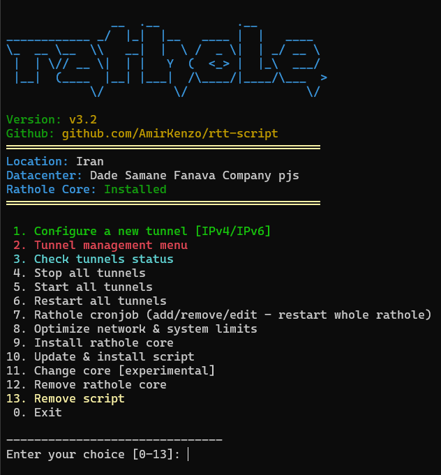
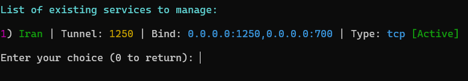

# What is Rathole?

A secure, stable and high-performance reverse proxy for NAT traversal, written in Rust

## How to Run?

```
bash <(curl -Ls --ipv4 https://raw.githubusercontent.com/AmirKenzo/rtt-script/refs/heads/main/rathole.sh)
```

## Menu (v3)


